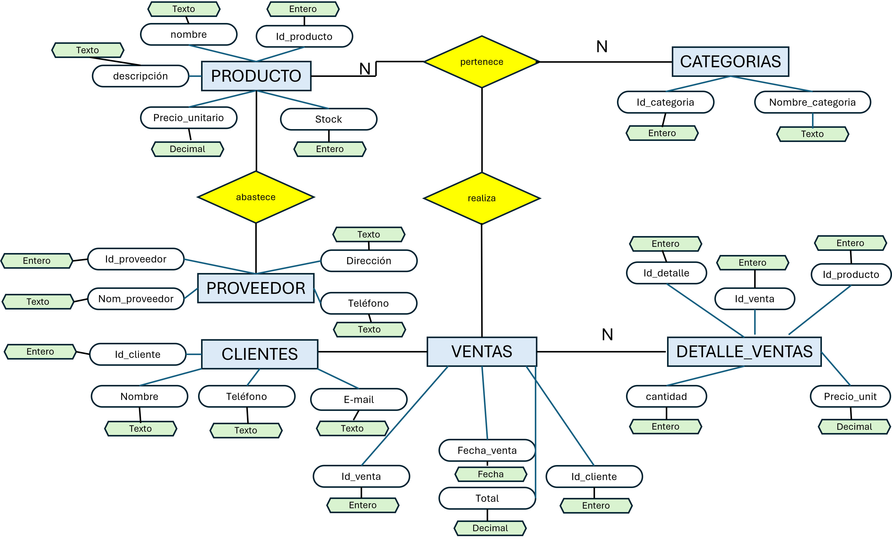

# Diagrama Entidad-Relación - Tarea 2

Este archivo contiene el diagrama entidad-relación (ER) de la base de datos de la Tienda de Abarrotes, correspondiente a la **Tarea 2**.

## Modelo Entidad-Relación

- Se representan las entidades principales como rectángulos.
- Atributos como elipses, con las llaves primarias subrayadas.
- Relaciones como rombos con cardinalidad claramente marcada.
- Se incluye la relación entre **ventas** y **empleados**.

## Descripción de Relaciones

1. Un **producto** pertenece a una **categoría** (N:1).
2. Un **producto** está asociado a un **proveedor** (N:1).
3. Una **venta** es realizada por un **cliente** (N:1).
4. Una **venta** contiene varios **detalles de venta** (1:N).
5. Cada **detalle de venta** hace referencia a un **producto** (N:1).
6. Una **venta** puede estar asociada a un **empleado** (N:1).

## Dominio de los atributos

### 1. Tabla `Productos`
| Atributo         | Tipo de Dato  | 
|------------------|---------------|
| `id_producto`    | entero        |
| `nombre`         | texto         |
| `descripcion`    | texto         |
| `precio_unitario`| decimal       |
| `stock`          | entero        |

### 2. Tabla `Categorías`
| Atributo          | Tipo de Dato  |
|-------------------|---------------|
| `id_categoria`    | entero        |
| `nombre_categoria`| texto         |

### 3. Tabla `Proveedores`
| Atributo         | Tipo de Dato  |
|------------------|---------------|
| `id_proveedor`   | entero        |
| `nombre_proveedor`| texto        |
| `telefono`       | texto         |
| `direccion`      | texto         |

### 4. Tabla `Clientes`
| Atributo         | Tipo de Dato  |
|------------------|---------------|
| `id_cliente`     | entero        |
| `nombre`         | texto         |
| `telefono`       | texto         |
| `email`          | texto         |

### 5. Tabla `Ventas`
| Atributo         | Tipo de Dato  |
|------------------|---------------|
| `id_venta`       | entero        |
| `fecha_venta`    | fecha         |
| `id_cliente`     | entero        |
| `total`          | decimal       |

### 6. Tabla `Detalle_Venta`
| Atributo         | Tipo de Dato  |
|------------------|---------------|
| `id_detalle`     | entero        |
| `id_venta`       | entero        |
| `id_producto`    | entero        |
| `cantidad`       | entero        |
| `precio_unitario`| decimal       |
