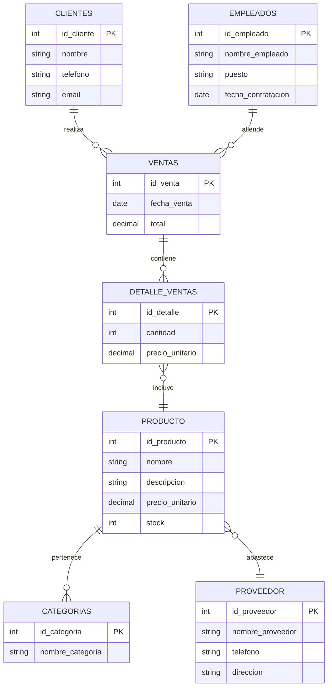

# Modelo Relacional - Tarea 3

## Operaciones del Álgebra Relacional

| **Operación**                 | **Explicación**                                                                                              | **Expresión**                                                                 |
|-------------------------------|--------------------------------------------------------------------------------------------------------------|--------------------------------------------------------------------------------|
| *1. Selección compuesta*        | Selecciona productos con precio entre 50 y 150, y con stock mayor a 10.                                      | `σ_precio_unitario ≥ 50 ∧ precio_unitario ≤ 150 ∧ stock > 10(PRODUCTO)`      |
| *2. Proyección sobre JOIN*      | Muestra solo el nombre del cliente y fecha de venta al combinar `CLIENTES` y `VENTAS`.                      | `π_nombre, fecha_venta(CLIENTES ⨝ VENTAS)`                                    |
| *3. Join con condición*         | Une productos y detalles de venta cuando el precio actual del producto es mayor al precio vendido.          | `σ PRODUCTO.precio_unitario > DETALLE_VENTAS.precio_unitario(PRODUCTO ⨝ DETALLE_VENTAS)` |
| *4. Renombramiento + selección* | Renombra la tabla `VENTAS` y selecciona ventas hechas por el empleado con ID 3.                             | `ρ ventas_renombradas(VENTAS)` `σ ventas_renombradas.id_empleado = 3(ventas_renombradas)` |
